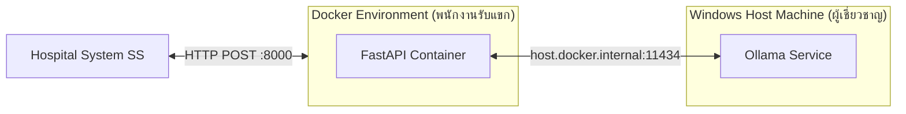
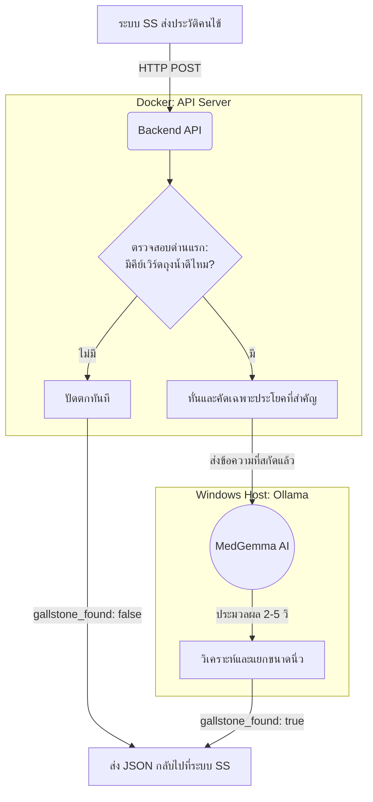

# 🏥 MedGemma Gallstone: Workflow & Architecture (สำหรับนำเสนอผู้บริหาร)

เอกสารฉบับนี้จัดทำขึ้นเพื่อแสดง **ผังการทำงาน (Workflow)** และ **ความพร้อมของระบบ (Feasibility)** ของโปรเจกต์ AI สกัดข้อมูลนิ่วในถุงน้ำดี ว่าสามารถนำไปใช้งานจริงร่วมกับระบบ SS ของโรงพยาบาลได้อย่างมีประสิทธิภาพ

---

## 1. 🏗️ สถาปัตยกรรมระบบ (System Architecture)

ระบบถูกออกแบบให้ **แยกส่วนการทำงาน** เพื่อไม่ให้ดึงทรัพยากรกัน และเพื่อให้ง่ายต่อการบำรุงรักษา

**จุดเด่น:**

- **Plug & Play:** ระบบ SS แค่ส่งข้อมูลมาทาง HTTP (เสมือนการเข้าเว็บไซต์) ไม่ต้องติดตั้ง AI ลงในระบบ SS เลย
- **No GPU Required:** ตัว AI ทำงานบน CPU ของเครื่อง Host ผ่าน Ollama ได้อย่างมีประสิทธิภาพ

---

## 2. 🧠 ลอจิกการทำงานของระบบ (Logic Flow)

กระบวนการตั้งแต่รับข้อมูลจากแพทย์ จนถึงการส่งคำตอบกลับไปยังระบบ

