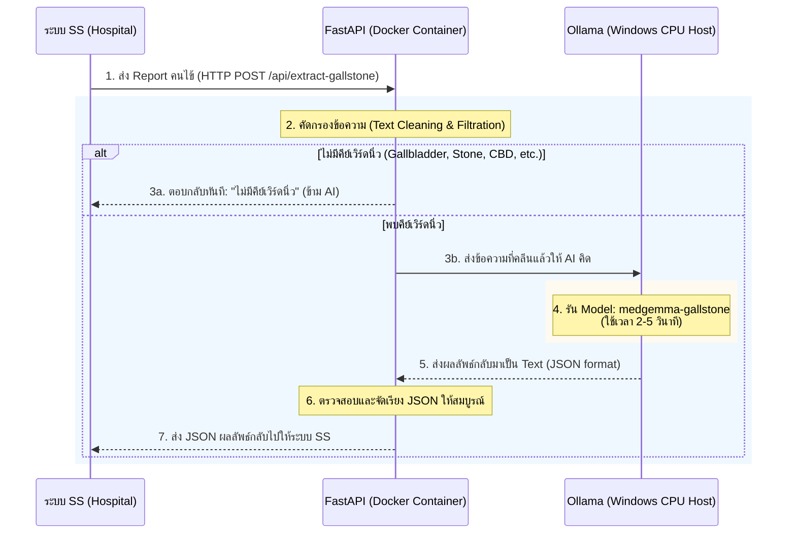

# 🔄 MedGemma Gallstone: Project Workflow & Architecture

เอกสารนี้แสดงแผนภาพ (Flowchart) การทำงานของโปรเจกต์นี้แบบครบวงจร ตั้งแต่กระบวนการสร้างโมเดล (AI Lifecycle) ไปจนถึงกระบวนการนำไปใช้งานจริงบนเซิร์ฟเวอร์ (Production Backend Flow)

---

## 1. 🧠 แผนภาพกระบวนการสร้างและประเมินผล AI (AI Lifecycle Flow)
กระบวนการนี้ทำเฉพาะตอนที่ต้องการสร้าง AI ตัวใหม่ หรืออัปเดตความรู้ให้ AI (ใช้ไฟล์สคริปต์ 01-06)

```mermaid
flowchart TD
    %% Define Styles
    classDef data fill:#e3f2fd,stroke:#1565c0,stroke-width:2px;
    classDef script fill:#f3e5f5,stroke:#7b1fa2,stroke-width:2px;
    classDef hardware fill:#fff3e0,stroke:#e65100,stroke-width:2px;
    classDef artifact fill:#e8f5e9,stroke:#2e7d32,stroke-width:2px;

    %% Data Preparation
    A[(Raw Excel Data<br/>จากคุณหมอ)]:::data --> B("01_generate_jsonl.py<br/>(สคริปต์ทำข้อมูล)"):::script
    B -->|แบ่ง 85%| C[train.jsonl<br/>(แบบฝึกหัด)]:::data
    B -->|แบ่ง 15%| D[val.jsonl<br/>(ข้อสอบ)]:::data

    %% Training
    C --> E("02_train_unsloth.py<br/>(สั่งสอน AI)"):::script
    Base[Google MedGemma 4B<br/>Base Model]:::artifact --> E
    E -->|ใช้เวลา ~3 ชม.| F((Cloud Server<br/>NVIDIA L4 GPU)):::hardware
    F --> G[unsloth_medgemma_v2<br/>(LoRA Adapter)]:::artifact

    %% Exporting
    G --> H("05_export_to_ollama.py<br/>(แปลงร่าง)"):::script
    H --> I[medgemma.Q4_K_M.gguf<br/>(สมอง AI พร้อมใช้)]:::artifact

    %% Evaluation
    D --> J("06_evaluate_ollama.py<br/>(สคริปต์สอบวัดผล)"):::script
    I -->|นำไปติดตั้งใน Ollama| J
    J --> K{Accuracy 98.10%<br/>Sensitivity 99.57%}:::artifact
```

---

## 2. ⚡ แผนภาพการทำงานของระบบ Backend (Production Backend Flow)
กระบวนการนี้คือสิ่งที่เกิดขึ้นจริงแบบ Real-time เมื่อนำระบบไปติดตั้งที่โรงพยาบาลและเชื่อมต่อกับระบบ SS



---

## 3. 🌐 แผนผังการจัดวางระบบเครือข่าย (Deployment Architecture)
แสดงให้เห็นถึงการทำงานร่วมกันระหว่าง Docker และ Host Machine

```mermaid
flowchart LR
    classDef ext fill:#eceff1,stroke:#607d8b,stroke-width:2px;
    classDef dock fill:#e1f5fe,stroke:#0288d1,stroke-width:2px;
    classDef win fill:#f1f8e9,stroke:#558b2f,stroke-width:2px;

    SS[Hospital System SS]:::ext <-->|HTTP POST :8000| Docker
    
    subgraph Docker ["Docker Environment"]
        API[FastAPI Container<br/>(main.py)]:::dock
    end
    
    subgraph Windows ["Windows Host Machine"]
        OLL[Ollama Service<br/>Port: 11434]:::win
        CPU((CPU & RAM)):::win
        OLL --- CPU
    end
    
    API <-->|host.docker.internal:11434| OLL
```
