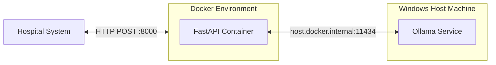

# MedGemma Gallstone AI Project

ระบบ AI (MedGemma) สำหรับการสกัดข้อมูลนิ่วในถุงน้ำดีจากข้อความทางการแพทย์ (Ultrasound Reports) อัตโนมัติให้ออกมาเป็นรูปแบบ JSON
โปรเจกต์นี้ถูกออกแบบให้สามารถประมวลผลบนคอมพิวเตอร์ทั่วไปได้โดยไม่จำเป็นต้องมีหน่วยประมวลผลกราฟิกแยก (No GPU Required) ด้วยการแบ่งสถาปัตยกรรมการทำงานออกเป็น 2 ส่วนหลัก:
1. **API Server (Backend):** ทำงานบน Docker Container (FastAPI) มีหน้าที่รับคำขอ (Request), คัดกรองข้อมูล, และจัดรูปแบบคำตอบ (Response)
2. **AI Engine:** ทำงานแบบ Native บนเครื่อง Host ผ่าน Ollama (CPU-based inference)

---

## สถาปัตยกรรมระบบ (Architecture)
การแยกส่วน API Server และ AI Engine ออกจากกัน เพื่อป้องกันไม่ให้ Docker ใช้ทรัพยากร RAM ร่วมกับตัวรัน AI และช่วยเพิ่มประสิทธิภาพ CPU ให้สามารถประมวลผลข้อมูล AI ได้รวดเร็วที่สุด (ประมาณ 2-5 วินาทีต่อคำขอ)



---

## คู่มือการติดตั้งระบบ (Setup Guide)

### ขั้นที่ 1: เตรียมไฟล์ AI Model (GGUF)
ระบบต้องใช้ไฟล์โมเดลที่ผ่านการ Fine-tune เรียบร้อยแล้ว (เช่น `medgemma-1.5-4b-it.Q4_K_M.gguf` ขนาดประมาณ 2.5 GB)
*หมายเหตุ: ไฟล์โมเดลไม่มีใน GitHub เนื่องจากมีขนาดใหญ่เกินข้อจำกัด กรุณาติดต่อผู้ดูแลโปรเจกต์เพื่อขอรับไฟล์*
ให้นำไฟล์ที่ได้รับมาวางไว้ในโฟลเดอร์ Root ของโปรเจกต์

### ขั้นที่ 2: ติดตั้งโปรแกรม Ollama (สำหรับรัน AI ด้วย CPU)
1. ดาวน์โหลดโปรแกรมจาก: https://ollama.com/download
2. ดำเนินการติดตั้งสำหรับระบบปฏิบัติการ Windows ตามปกติ

### ขั้นที่ 3: นำเข้า AI Model สู่ระบบ Ollama
1. ตรวจสอบให้แน่ใจว่าไฟล์ `Modelfile` (ที่มีอยู่ในโปรเจกต์นี้) อยู่ในโฟลเดอร์เดียวกับไฟล์โมเดล GGUF
2. เปิด PowerShell และนำทาง (cd) ไปยังโฟลเดอร์ดังกล่าว
3. รันคำสั่งต่อไปนี้เพื่อนำเข้าโมเดลเข้าสู่ระบบ Ollama:
   ```powershell
   ollama create medgemma-gallstone -f Modelfile
   ```

### ขั้นที่ 4: เปิดระบบ Backend API (Docker)
1. ติดตั้ง Docker Desktop สำหรับ Windows
2. เปิด PowerShell และนำทางไปยังโฟลเดอร์ `backend`:
   ```powershell
   cd backend
   ```
3. รันคำสั่งสร้างและเปิด Backend Container:
   ```powershell
   docker-compose up -d --build
   ```
*(ตรวจสอบความพร้อมของระบบได้ที่: `http://localhost:8000/health`)*
*(สามารถทดสอบการเรียกใช้งาน API ผ่าน Swagger UI ได้ที่: `http://localhost:8000/docs`)*

---

## คู่มือเชื่อมต่อ API (API Connection Guide)

ระบบสื่อสารด้วย JSON ผ่านโพรโทคอล HTTP POST แบบ Synchronous 

### Endpoint: `/api/extract-gallstone`
- **Method:** `POST`
- **URL:** `http://<IP-Address>:8000/api/extract-gallstone` (หากเรียกจากเครื่องเดียวกันใช้ `localhost:8000`)
- **Content-Type:** `application/json`

#### Request Payload (ขาเข้า)
```json
{
  "raw_text": "Evidence: The gallbladder is distended and contains multiple small gallstones, size up to 1.5 cm..."
}
```

#### Response (ขาออก - กรณีพบข้อมูลนิ่ว)
```json
{
  "gallstone_found": true,
  "size_min": null,
  "size_max": 1.5,
  "size_summation": null,
  "unit": "cm"
}
```

#### Response (ขาออก - กรณีไม่พบคำสำคัญที่เกี่ยวข้องกับถุงน้ำดี)
ระบบจะทำการตรวจสอบคำสำคัญ (Keyword filtering) หากไม่พบคำที่เกี่ยวข้อง ระบบจะไม่ส่งข้อความต่อไปยัง AI Engine เพื่อประหยัดทรัพยากร และจะตอบกลับทันทีดังนี้:
```json
{
  "gallstone_found": false,
  "size_min": null,
  "size_max": null,
  "size_summation": null,
  "unit": null,
  "_note": "ไม่มีคีย์เวิร์ดเกี่ยวกับถุงน้ำดีใน Report"
}
```

---

## วิธีการเปลี่ยนหรืออัปเดตโมเดล (How to Update Model)

หากมีการอัปเดตไฟล์โมเดลเวอร์ชันใหม่ (เช่น เวอร์ชัน v2) ให้ปฏิบัติตาม 3 ขั้นตอนดังนี้:

1. **ติดตั้งโมเดลตัวใหม่ลงใน Ollama:**
   นำไฟล์ `.gguf` เวอร์ชันใหม่มาวาง แก้ไขไฟล์ `Modelfile` ให้บรรทัด `FROM` ระบุชื่อไฟล์ใหม่ และรันคำสั่งสร้างชื่อโมเดลใหม่:
   ```powershell
   ollama create medgemma-v2 -f Modelfile
   ```
2. **เปลี่ยนชื่อโมเดลในโค้ด Backend:**
   เปิดไฟล์ `backend/main.py` ค้นหาบรรทัด `MODEL_NAME = "medgemma-gallstone"` แล้วแก้ไขเป็นชื่อโมเดลใหม่ (`medgemma-v2`)
3. **รีสตาร์ท Backend:**
   นำทางไปยังโฟลเดอร์ `backend` แล้วรันคำสั่งเพื่อให้ Docker บิลด์อิมเมจใหม่ด้วยโค้ดล่าสุด:
   ```powershell
   docker-compose up -d --build
   ```

---

## การบำรุงรักษาและปัญหาที่พบบ่อย (Maintenance & Troubleshooting)

- **การหยุดการทำงานของ API:** รันคำสั่ง `docker-compose down` ในโฟลเดอร์ backend
- **การตรวจสอบ Log ของระบบ:** รันคำสั่ง `docker logs -f medgemma-api`
- **ปัญหาการเชื่อมต่อ API จากเครื่องอื่น:** ให้ตรวจสอบ Windows Defender Firewall ในเครื่องที่เปิดใช้งาน AI ว่ามีการอนุญาต (Inbound Rule) ให้เข้าถึงพอร์ต 8000 ได้หรือไม่
