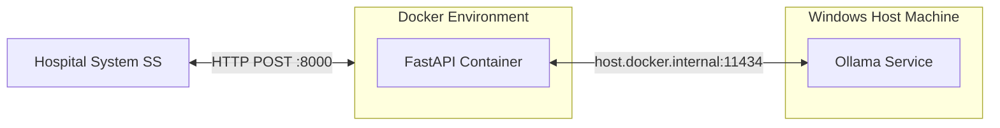

# 🏥 MedGemma Gallstone AI Project

ระบบ AI (MedGemma) สำหรับการสกัดข้อมูลนิ่วในถุงน้ำดีจากข้อความทางการแพทย์ (Ultrasound Reports) อัตโนมัติให้ออกมาเป็นรูปแบบ JSON
โปรเจกต์นี้ถูกออกแบบให้ **รันบนคอมพิวเตอร์ทั่วไปได้โดยไม่ต้องมีการ์ดจอ (No GPU Required)** ด้วยการแบ่งการทำงานเป็น 2 ส่วน:
1. **API Server (Backend):** รันบน Docker Container (FastAPI) ทำหน้าที่รับคำขอ, คัดกรองข้อมูล, และจัดรูปแบบคำตอบ
2. **AI Engine:** รันแบบ Native บนเครื่อง Host ผ่าน Ollama (CPU-based inference)

---

## 🏗️ สถาปัตยกรรมระบบ (Architecture)
*(เหตุผลที่แยกกัน เพื่อให้ Docker ไม่แย่งทรัพยากร RAM กับ AI และรีดประสิทธิภาพ CPU ให้ AI คิดคำตอบได้ไวที่สุดใน 2-5 วินาที)*



---

## 🚀 คู่มือการติดตั้งระบบตั้งแต่ศูนย์ (Setup Guide)

### 📥 ขั้นที่ 1: เตรียมไฟล์สมอง AI (GGUF)
ระบบต้องใช้ไฟล์โมเดลที่ฝึกสอนมาแล้ว (เช่น `medgemma-1.5-4b-it.Q4_K_M.gguf` ขนาดประมาณ 2.5 GB) 
*ไฟล์นี้ไม่มีใน GitHub เนื่องจากมีขนาดใหญ่ กรุณาขอไฟล์จากผู้ดูแลโปรเจกต์*
นำไฟล์ที่ได้มาวางไว้ในโฟลเดอร์เดียวกับโปรเจกต์ (เช่น โฟลเดอร์ต้นทาง)

### 🦙 ขั้นที่ 2: ติดตั้งโปรแกรม Ollama (ตัวรัน AI บน CPU)
1. ดาวน์โหลดโปรแกรมจาก: [https://ollama.com/download](https://ollama.com/download)
2. ติดตั้งแบบปกติสำหรับ Windows (เมื่อติดตั้งเสร็จจะมีไอคอนลามะที่มุมขวาล่างจอ)

### ⚙️ ขั้นที่ 3: นำเข้าสมอง AI สู่ระบบ Ollama
1. นำไฟล์ `Modelfile` (ที่มีอยู่ในโปรเจกต์นี้) ไปวางไว้ที่เดียวกับไฟล์โมเดล GGUF ของคุณ
2. เปิด PowerShell แล้วเข้าไปที่โฟลเดอร์นั้น
3. พิมพ์คำสั่งดึงโมเดลเข้าฐานข้อมูลของ Ollama:
   ```powershell
   ollama create medgemma-gallstone -f Modelfile
   ```

### 🐳 ขั้นที่ 4: เปิดระบบ Backend API (Docker)
1. ติดตั้ง **Docker Desktop** สำหรับ Windows
2. เปิด PowerShell และเข้าไปที่โฟลเดอร์ `backend`:
   ```powershell
   cd backend
   ```
3. รันคำสั่งสร้างและเปิด Backend:
   ```powershell
   docker-compose up -d --build
   ```
*(เช็คความพร้อมได้โดยเข้าเบราว์เซอร์ไปที่: `http://localhost:8000/health`)*
*(หรือเข้าไปทดสอบยิง API ได้ด้วยตัวเองผ่านหน้าเว็บ: `http://localhost:8000/docs`)*

---

## 📡 คู่มือเชื่อมต่อ API (สำหรับทีมพัฒนาระบบโรงพยาบาล SS)

ระบบสื่อสารด้วย **JSON** ผ่านโพรโทคอล **HTTP POST** แบบ Synchronous 

### 🟢 Endpoint: `/api/extract-gallstone`
- **Method:** `POST`
- **URL:** `http://<IP-เครื่องรันAI>:8000/api/extract-gallstone` (หากยิงจากเครื่องเดียวกันใช้ `localhost:8000`)
- **Content-Type:** `application/json`

#### 📤 Request Payload (ขาเข้า)
```json
{
  "raw_text": "Evidence: The gallbladder is distended and contains multiple small gallstones, size up to 1.5 cm..."
}
```

#### 📥 Response (ขาออก - กรณีเจอคีย์เวิร์ดและ AI สกัดได้)
```json
{
  "gallstone_found": true,
  "size_min": null,
  "size_max": 1.5,
  "size_summation": null,
  "unit": "cm"
}
```

#### 📥 Response (ขาออก - กรณีที่ในข้อความไม่มีการพูดถึงถุงน้ำดีเลย)
ระบบจะมีฟังก์ชันสแกนคีย์เวิร์ดก่อน หากไม่พบระบบจะไม่ส่งต่อให้ AI (เพื่อประหยัดทรัพยากร) และจะตอบกลับทันที:
```json
{
  "gallstone_found": false,
  "size_min": null,
  "size_max": null,
  "size_summation": null,
  "unit": null,
  "_note": "ไม่มีคีย์เวิร์ดเกี่ยวกับถุงน้ำดีใน Report"
}
```

---

## 🔄 วิธีการเปลี่ยน/อัปเดตโมเดล (How to Change Model)

หากในอนาคตมีการอัปเดตไฟล์โมเดลเวอร์ชันใหม่ (เช่น เป็น v2) ให้ทำตาม 3 ขั้นตอนนี้:

1. **ติดตั้งโมเดลตัวใหม่ลงใน Ollama:**
   นำไฟล์ `.gguf` ตัวใหม่มา แก้ไฟล์ `Modelfile` ให้ชี้ไปที่ไฟล์ใหม่ แล้วรันสร้างชื่อใหม่:
   ```powershell
   ollama create medgemma-v2 -f Modelfile
   ```
2. **เปลี่ยนชื่อโมเดลในโค้ด Backend:**
   เปิดไฟล์ `backend/main.py` ค้นหาบรรทัด `MODEL_NAME = "medgemma-gallstone"` แล้วแก้เป็นชื่อโมเดลใหม่ (`medgemma-v2`)
3. **รีสตาร์ท Backend:**
   เข้าไปที่โฟลเดอร์ `backend` แล้วรันคำสั่งเพื่อให้ Docker อัปเดตโค้ด:
   ```powershell
   docker-compose up -d --build
   ```

---

## 🛠️ การบำรุงรักษาและปัญหาที่พบบ่อย (Maintenance)

- **หยุดการทำงานของ API:** พิมพ์ `docker-compose down` ในโฟลเดอร์ backend
- **ดู Log การทำงาน:** พิมพ์ `docker logs -f medgemma-api`
- **ระบบ SS ยิง API เข้ามาไม่ทะลุ:** ให้เช็ค Windows Defender Firewall ในเครื่องที่รัน AI ว่ามีการเปิดอนุญาต (Inbound Rule) ให้พอร์ต 8000 ผ่านได้หรือยัง
