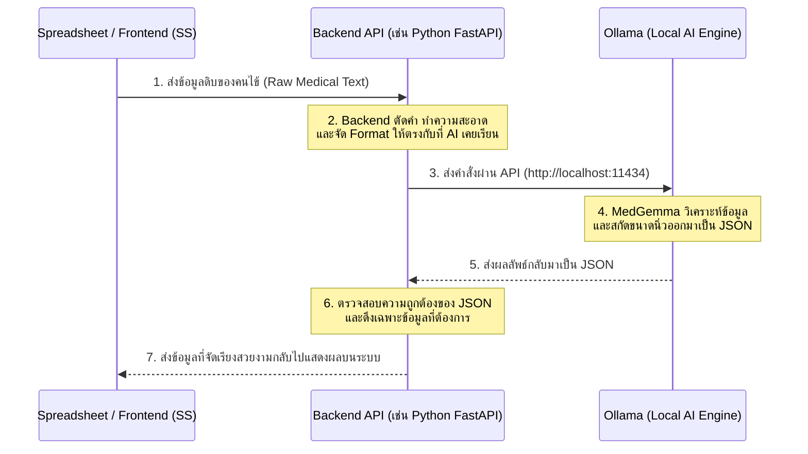

# สถาปัตยกรรมระบบและคู่มือการนำ AI ไปใช้งานจริง (Production Architecture Guide)

เอกสารฉบับนี้อธิบายสถาปัตยกรรมการนำโมเดล **MedGemma-Gallstone** ที่เราทำการ Fine-tune เสร็จแล้ว ไปประยุกต์ใช้งานจริงในคลินิกหรือโรงพยาบาล โดยเชื่อมต่อระหว่างระบบจัดการข้อมูล (SS), Backend API, และ Ollama ครับ

---

## 1. แผนภาพการทำงานของระบบ (System Workflow)

นี่คือ Flow การทำงานตั้งแต่ต้นน้ำ (รับข้อมูล) ไปจนถึงปลายน้ำ (ส่งผลลัพธ์) ครับ:



---

## 2. การนำไฟล์ GGUF ไปติดตั้งใน Ollama
เมื่อคุณหมอรันสคริปต์บน Server เสร็จ และดาวน์โหลดไฟล์ `.gguf` ลงมาที่เครื่องคอมพิวเตอร์ (เครื่องที่จะรัน Backend) แล้ว ให้ทำตามนี้ครับ:

1. สร้างไฟล์ Text ธรรมดาขึ้นมา 1 ไฟล์ ตั้งชื่อว่า `Modelfile` (ไม่ต้องมีนามสกุล)
2. ใส่โค้ดนี้ลงไปใน `Modelfile`:
   ```text
   FROM ./medgemma-gallstone-q4_k_m.gguf
   
   TEMPLATE """<|im_start|>user
   {{ .Prompt }}<|im_end|>
   <|im_start|>assistant
   """
   ```
3. เปิด Command Prompt ในโฟลเดอร์นั้น แล้วสั่งสร้างโมเดลเข้า Ollama:
   ```bash
   ollama create medgemma-gallstone -f Modelfile
   ```
4. ทดสอบรัน AI ในเครื่อง:
   ```bash
   ollama run medgemma-gallstone
   ```

---

## 3. การเขียน Backend (Python FastAPI) พร้อมระบบ "ตัดคำ"
ทำไม Backend ถึงสำคัญ? เพราะข้อมูลดิบที่ส่งมาจาก Spreadsheet (SS) หรือระบบ HIS ของโรงพยาบาล มักจะมี "ขยะ" หรือ "ช่องว่าง" เยอะมาก ซึ่งอาจทำให้ AI สับสนได้ Backend จึงต้องมีหน้าที่ **"ตัดคำและทำความสะอาด (Text Preprocessing)"** ก่อนส่งให้ AI ครับ

**ตัวอย่างโค้ด Backend (Python):**

```python
import re
import json
import requests
from fastapi import FastAPI, HTTPException
from pydantic import BaseModel

app = FastAPI()

# โครงสร้างข้อมูลที่รับมาจาก SS (Spreadsheet)
class PatientData(BaseModel):
    raw_text: str

# คีย์เวิร์ดสำหรับดึงเฉพาะประโยคที่เกี่ยวกับนิ่ว/ถุงน้ำดี (เหมือนกับที่เราใช้ทำ Data Training)
GB_KEYWORDS = re.compile(r"\b(gallbladder|gall\s*bladder|gb|gall\s*stones?|gallstones?|gb\s*stones?|cholelithiasis|calculi|calculus|gs|stones?|biliary|cystic\s+duct|bile\s+ducts?|cbd|ihd|cholecyst\w*|polyps?|sludges?)\b", re.IGNORECASE)

def clean_medical_text(report: str) -> str:
    """
    ฟังก์ชันสกัดเฉพาะย่อหน้าที่เกี่ยวกับนิ่ว/ถุงน้ำดี (อัลกอริทึมเดียวกับตอนทำ Test Data)
    """
    report = str(report) if report else ""
    if not report.strip():
        return ""
        
    # แยกส่วนผลตรวจ (Findings) กับสรุป (Impression)
    impression_match = re.search(r"\b(?:impression|opinion|conclusion)[\s:;\.-]*(.*)", report, re.IGNORECASE | re.DOTALL)
    if impression_match:
        imp_text = impression_match.group(1)
        finding_text = report[:impression_match.start()]
    else:
        imp_text = ""
        finding_text = report
        
    def extract_gb_paragraphs(text: str) -> str:
        lines = text.replace("\r\n", "\n").split("\n")
        kept_lines = []
        for line in lines:
            line_clean = line.strip()
            if not line_clean:
                continue
            # ดึงเฉพาะย่อหน้าที่มีคีย์เวิร์ดถุงน้ำดี
            if GB_KEYWORDS.search(line_clean):
                line_clean = re.sub(r"\s+", " ", line_clean)
                kept_lines.append(line_clean.lower())
        return " ".join(kept_lines)

    parts = []
    
    # ดึงจากส่วน Findings
    f_finding = extract_gb_paragraphs(finding_text)
    if f_finding:
        parts.append(f"Evidence: {f_finding}")
            
    # ดึงจากส่วน Impression
    if imp_text.strip():
        i_finding = extract_gb_paragraphs(imp_text)
        if i_finding:
            if not f_finding or i_finding not in f_finding:
                parts.append(f"Impression: {i_finding}")
                    
    if not parts:
        return "No relevant gallstone context found."
        
    return " | ".join(parts)

@app.post("/api/extract-gallstone")
def extract_data(patient: PatientData):
    # ==========================================
    # 1. จัดการตัดคำและทำความสะอาด (Preprocessing)
    # ==========================================
    cleaned_text = clean_medical_text(patient.raw_text)
    
    # ==========================================
    # 2. ยิงข้อมูลไปหา Ollama
    # ==========================================
    ollama_url = "http://localhost:11434/api/generate"
    payload = {
        "model": "medgemma-gallstone",
        "prompt": cleaned_text,
        "format": "json", # บังคับให้ Ollama ตอบกลับมาเป็น JSON เท่านั้น
        "stream": False,
        "options": {
            "temperature": 0.0 # ตั้งค่าเป็น 0 เพื่อไม่ให้ AI แต่งเรื่องมั่ว (เน้นดึงข้อมูลตามจริง)
        }
    }
    
    try:
        # ส่งคำขอไปให้ Ollama
        response = requests.post(ollama_url, json=payload)
        response_data = response.json()
        
        # ==========================================
        # 3. จัดการข้อมูลที่ได้จาก AI (Postprocessing)
        # ==========================================
        ai_output = response_data.get("response", "{}")
        
        # แปลงข้อความกลับเป็น Dictionary ของ Python
        result_json = json.loads(ai_output)
        
        # ส่งกลับไปให้ระบบ Frontend / SS อย่างสวยงาม
        return {
            "status": "success",
            "message": "AI วิเคราะห์สำเร็จ",
            "data": result_json
        }
        
    except Exception as e:
        raise HTTPException(status_code=500, detail=f"Ollama Error: {str(e)}")

# วิธีรัน Backend นี้ (เปิดใน Terminal):
# pip install fastapi uvicorn requests
# uvicorn main:app --reload --port 8000
```

### อธิบายการทำงานของ Backend นี้:
1. **SS ส่งข้อมูล:** ยิง HTTP POST เข้ามาที่ `/api/extract-gallstone` พร้อมแนบประวัติคนไข้มา
2. **Backend ตัดคำ:** ฟังก์ชัน `clean_medical_text` จะทำการลบช่องว่าง, ลบการเคาะบรรทัดที่เกินความจำเป็น, และลบข้อความขยะทิ้ง เพื่อให้ข้อความกระชับที่สุด (ประหยัดเวลา AI คิด)
3. **Backend คุยกับ Ollama:** โค้ดจะยิงข้อมูลไปหา `http://localhost:11434` (Ollama ในเครื่อง) และมีการตั้งค่า `format: "json"` เพื่อบังคับให้ AI ตอบกลับมาเป็นโครงสร้าง JSON 100% ป้องกันมันพูดพร่ำทำเพลง
4. **ส่งคืน SS:** Backend จัดเรียง JSON ให้สวยงาม และส่งกลับไปให้ Spreadsheet เอาไปกรอกลงตาราง Excel อัตโนมัติครับ!
